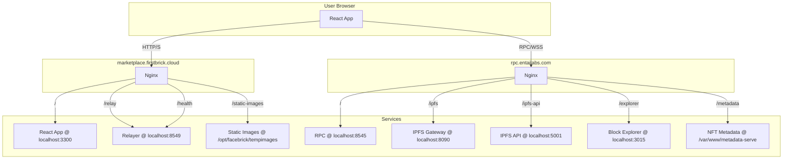

# FirstBrick System Overview

This document provides a high-level overview of the FirstBrick system architecture. It is intended for new developers to quickly understand the different components and how they interact.

## Architecture Diagram

## Components

### marketplace.firstbrick.cloud

This is the main entry point for the FirstBrick application. It is a React-based single-page application that provides the user interface for the marketplace.

*   **Nginx Configuration:** The Nginx configuration for `marketplace.firstbrick.cloud` routes requests to the appropriate backend services.
    *   `/`: All requests to the root are proxied to the React application running on `localhost:3300`.
    *   `/relay`: Requests to `/relay` are proxied to the relayer service on `localhost:8549`. This service is responsible for handling gasless transactions.
    *   `/static-images`: Requests to `/static-images` are served directly from the filesystem at `/opt/facebrick/tempimages`. This is used to serve images and other static assets.
    *   `/health`: The `/health` endpoint is used for health checks and is proxied to the relayer service on `localhost:8549`.

### rpc.entailabs.com

This server provides RPC and other blockchain-related services.

*   **Nginx Configuration:** The Nginx configuration for `rpc.entailabs.com` routes requests to various backend services.
    *   `/`: The root of the domain is an RPC endpoint, proxying to `localhost:8545`.
    *   `/ipfs/`: This is an IPFS gateway, proxying to `localhost:8090`. It's used to retrieve profile data and images.
    *   `/ipfs-api/`: This is the IPFS API for file uploads, proxying to `localhost:5001`. It's used for profile persistence.
    *   `/explorer`: This is a block explorer, proxying to `localhost:3015`.
    *   `/metadata/`: This endpoint serves NFT metadata from the `/var/www/metadata-serve` directory.

## Services

*   **React App (localhost:3300):** The main frontend application.
*   **Relayer (localhost:8549):** Handles gasless transactions and health checks.
*   **RPC (localhost:8545):** The main RPC endpoint for interacting with the blockchain.
*   **IPFS Gateway (localhost:8090):** Retrieves files from the IPFS network.
*   **IPFS API (localhost:5001):** Adds files to the IPFS network.
*   **Block Explorer (localhost:3015):** A web-based tool for exploring the blockchain.
*   **Static Images (/opt/facebrick/tempimages):** A directory on the server that stores static images.
*   **NFT Metadata (/var/www/metadata-serve):** A directory on the server that stores NFT metadata.
